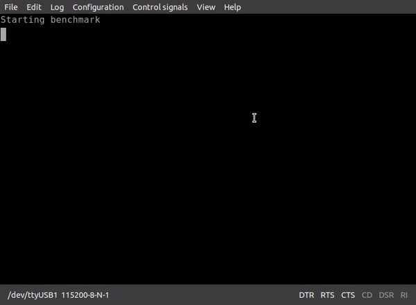

# rv32I-TangNano9K
**RV32I Implementation on TangNano9K**

You can run CoreMark Benchmark on this CPU. You can use UART.

# five-staged-rv32i
simple CPU that execute 5 stage.
| 1   | 2   | 3   | 4   | 5   | 6   | 7   | 8   | 9   | 10  |
| --- | --- | --- | --- | --- | --- | --- | --- | --- | --- |
| F   | D   | E   | M   | W   |     |     |     |     |     |
|     |     |     |     |     | F   | D   | E   | M   | W   |

# five-pipeline-rv32i
CPU that execute 5 stage pipeline.
This CPU has 2bit branching prediction and forwarding functions.

| 1   | 2   | 3   | 4   | 5   | 6   | 7   | 8   | 9   | 10  |
| --- | --- | --- | --- | --- | --- | --- | --- | --- | --- |
| F   | D   | E   | M   | W   |     |     |     |     |     |
|     | F   | D   | E   | M   | W   |     |     |     |     |
|     |     | F   | D   | E   | M   | W   |     |     |     |
|     |     |     | F   | D   | E   | M   | W   |     |     |
|     |     |     |     | F   | D   | E   | M   | W   |     |
|     |     |     |     |     | F   | D   | E   | M   | W   |

## Description by ChatGPT
Branching prediction is a technique used when processing branching instructions contained in the code of a program that the CPU executes. Branching instructions allow the program to branch to two different processing paths based on a condition contained within the program code. Examples of branching instructions include if statements and switch statements. The purpose of branching prediction is to shorten the time required to process branching instructions by predicting in advance which branching direction the branching instruction will take and processing the predicted direction first.

Forwarding is a technique that reduces the execution time of instructions by pre-fetching the necessary data before executing the instructions. The CPU can process multiple instructions at the same time, but this requires time to retrieve the data required by each instruction. By pre-fetching the data required by each instruction, the CPU can shorten the execution time of the instruction.

# Resource used
| name         | PicoRV32                                                                                                                          | five-staged-rv32i | five-pipeline-rv32i |
| ------------ | --------------------------------------------------------------------------------------------------------------------------------- | ----------------- | ------------------- |
| LUT          | 1951/8640                                                                                                                         | 1360/8640         | 2748/8640           |
| FF           | 799/6693                                                                                                                          | 328/6693          | 783/6693            |
| CLS          | 1207/4320                                                                                                                         | 836/4320          | 1790/4320           |
| BSRAM        | 3SDPB/1pROM                                                                                                                       | 10SDPB/16pROM     | 7SDPB/16pROM        |
| Max Clock    | 57.198Mhz                                                                                                                         | 27.493Mhz         | 32.089Mhz           |
| CoreMark/Mhz | About 0.4 ([refer from this](https://www.esa.informatik.tu-darmstadt.de/assets/publications/materials/2019/heinz_reconfig19.pdf)) | 0.259             | 1.04                |

*PicoRV32 data is quoted from Interface 2022/12

# memory map
| Address       | Size  | Section                          |
| ------------- | ----- | -------------------------------- |
| 0x0000-0x0100 | 256B  | unused                           |
| 0x0100-0x6100 | 24KiB | .text(ROM)                       |
| 0x6100-0x6900 | 2KiB  | .rodata+.data+.bss+.comment(RAM) |
| 0x6900-0x7d00 | 5KiB  | stack(RAM)                       |